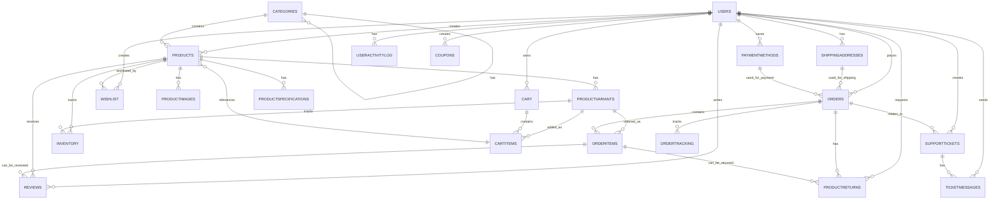

# Tekzo E-Commerce Database - Entity Relationship Diagram

## Visual ERD (Mermaid Diagram)



---

## Table Relationships Summary

### Core Data Flow

**User Journey:**

- User (signup/login) → Cart → Orders → OrderItems → Reviews/Returns
- User → Wishlist → Products
- User → Support Tickets → Messages

**Product Management:**

- Categories → Products → ProductImages, Variants, Specifications
- Products → Reviews (ratings)
- Products → Inventory (stock tracking)

**Order Processing:**

- Orders ← Cart (conversion)
- Orders → OrderItems → Products
- Orders → OrderTracking (shipping)
- Orders → Payments (PaymentMethods)
- Orders → Shipping (ShippingAddresses)

**Support & Returns:**

- Orders → ProductReturns (refunds)
- Users → SupportTickets → TicketMessages
- Products → Reviews (feedback)

---

## Database Design Principles Applied

✅ **Normalization:** All tables in 3NF to eliminate redundancy
✅ **Referential Integrity:** Foreign key constraints enforced
✅ **Scalability:** Indexes on frequently queried columns
✅ **Audit Trail:** Activity logs for users and admins
✅ **Flexibility:** Enum types for statuses, JSON for flexible data
✅ **Performance:** Strategic indexing on common query patterns
✅ **Data Integrity:** Check constraints and cascading deletes
✅ **Multi-tenancy Ready:** Support for multiple vendors/partners

---

## Schema Statistics

| Aspect        | Count |
| ------------- | ----- |
| Total Tables  | 23    |
| Relationships | 35+   |
| Primary Keys  | 23    |
| Foreign Keys  | 40+   |
| Indexes       | 30+   |
| Enums         | 15    |
| Triggers      | 2     |

---

## Data Type Guidelines

- **INT:** Integer values, IDs, counts
- **VARCHAR:** Strings with fixed max length
- **TEXT:** Long text content (descriptions, messages)
- **DECIMAL(10,2):** Monetary values (prices, amounts)
- **DECIMAL(5,2):** Percentages
- **DATETIME/TIMESTAMP:** Date and time tracking
- **BOOLEAN:** Binary states
- **ENUM:** Fixed set of values (status, types)
- **JSON:** Flexible data structure (audit logs)

---

## Security Considerations

🔒 **Implemented:**

- Password hashing (password_hash, never plain text)
- Email verification tracking
- Role-based access (customer/admin/vendor)
- Audit logs (AdminActivityLog, UserActivityLog)
- Encrypted payment data (card_last_four only)
- Bank details not fully stored

⚠️ **To Implement in Application:**

- Use bcrypt/Argon2 for password hashing
- Implement JWT or session tokens
- Add row-level security for sensitive data
- Encrypt PII (PII) fields in database
- Implement API rate limiting
- Add SQL injection prevention (parameterized queries)

---

## Performance Optimization Strategies

### Indexes Created:

```
- Users: email, role
- Products: category, sku, featured
- Orders: user_id, status, payment_status
- Reviews: product, user, published status
- Cart: user_id
- Wishlist: user_id, product_id
- Various composite indexes on common queries
```

### Query Optimization Tips:

1. Use LIMIT for large datasets
2. Avoid SELECT \* - specify needed columns
3. Use JOIN instead of multiple queries
4. Implement pagination on list views
5. Cache frequently accessed data
6. Archive old orders/logs periodically

---

## Partitioning Strategy (For Future Growth)

**Consider partitioning by date for:**

- Orders (partition by created_at - monthly)
- UserActivityLog (partition by created_at - monthly)
- AdminActivityLog (partition by created_at - monthly)
- Reviews (partition by created_at - quarterly)

---

## Sample Data Seeds

### Basic Categories:

```sql
INSERT INTO Categories (category_name, category_description) VALUES
('Electronics', 'Mobile phones, laptops, tablets'),
('Fashion', 'Clothing, shoes, accessories'),
('Home & Kitchen', 'Household appliances and cookware'),
('Sports', 'Sports equipment and accessories'),
('Books', 'Physical and digital books');
```

### Sample User:

```sql
INSERT INTO Users (email, password_hash, first_name, last_name, role) VALUES
('user@example.com', 'hashed_password_here', 'John', 'Doe', 'customer');
```

---

## Database Maintenance

### Regular Tasks:

- **Daily:** Monitor slow queries, check replication
- **Weekly:** Backup verification, index maintenance
- **Monthly:** Analyze table statistics, clean old logs
- **Quarterly:** Archive old orders, optimize storage
- **Yearly:** Capacity planning, schema review

### Monitoring Queries:

```sql
-- Check table sizes
SELECT table_name, ROUND(((data_length + index_length) / 1024 / 1024), 2) AS size_mb
FROM information_schema.TABLES WHERE table_schema = 'tekzo_db';

-- Check slow queries
SELECT * FROM mysql.slow_log;

-- Monitor active connections
SHOW PROCESSLIST;
```

---

## Backup & Recovery

- **Backup Strategy:** Full backup daily + incremental hourly
- **Retention:** 30-day retention for point-in-time recovery
- **Testing:** Test restore procedures weekly
- **Location:** Separate geographic location
- **Encryption:** Backup encryption at rest and in transit

---

## Migration & Version Control

Keep schema versions tracked:

```sql
CREATE TABLE schema_migrations (
    id INT PRIMARY KEY AUTO_INCREMENT,
    version VARCHAR(50),
    description TEXT,
    applied_at TIMESTAMP DEFAULT CURRENT_TIMESTAMP
);
```

---

## Next Steps for Implementation

1. **Create Database:** Execute DATABASE_SCHEMA.sql
2. **Verify Schema:** Run validation checks
3. **Add Sample Data:** Insert test data
4. **Test Relationships:** Verify all foreign keys work
5. **Performance Test:** Load test with realistic data
6. **Document API:** Map database schema to API endpoints
7. **Set Permissions:** Configure user roles and access levels
8. **Deploy:** Move to production environment

---

**Database Schema Version:** 1.0
**Last Updated:** May 3, 2026
**Status:** Ready for Implementation ✅
